# ModelOpsLab

**Production-style MLOps platform for reproducible training, deployment, monitoring, governed retraining, and rollback.**


## Problem Statement

Training a model is only one part of operating ML safely. ModelOpsLab addresses the surrounding questions:

```text
Can the run be reproduced?
Can invalid data block training?
Which model is serving?
Can behavior and drift be monitored?
Can a weak retraining candidate be rejected?
Can serving changes be validated and rolled back?
```

## Architecture At A Glance

```mermaid
flowchart LR
    subgraph build["Build and govern"]
        data["Versioned data<br/>and schemas"]
        validate["Validation<br/>gates"]
        train["Training and<br/>MLflow experiments"]
        orchestrate["Prefect<br/>orchestration"]
        registry["Model registry<br/>candidate / champion / archived"]

        data --> validate --> train --> orchestrate --> registry
    end

    subgraph serve["Serve and deploy"]
        api["FastAPI<br/>health / ready / predict"]
        container["Docker<br/>container"]
        cloud["Artifact Registry<br/>and Cloud Run"]

        registry --> api --> container --> cloud
    end

    subgraph observe["Observe"]
        telemetry["Prediction<br/>telemetry"]
        metrics["Prometheus<br/>metrics"]
        dashboard["Grafana dashboard<br/>alerts and drift"]

        api --> telemetry --> metrics --> dashboard
    end

    subgraph evolve["Governed retraining"]
        trigger["Retraining<br/>decision"]
        candidate["Candidate training<br/>and comparison"]
        approval["Human approval<br/>and promotion record"]
        update["Validated local<br/>update or rollback"]

        trigger --> candidate --> approval --> update
    end

    dashboard --> trigger
    update --> registry
    update -. explicit deployment remains separate .-> cloud

    classDef buildNode fill:#dcfce7,stroke:#15803d,color:#14532d
    classDef serveNode fill:#dbeafe,stroke:#1d4ed8,color:#1e3a8a
    classDef observeNode fill:#fef3c7,stroke:#b45309,color:#78350f
    classDef evolveNode fill:#f3e8ff,stroke:#7e22ce,color:#581c87

    class data,validate,train,orchestrate,registry buildNode
    class api,container,cloud serveNode
    class telemetry,metrics,dashboard observeNode
    class trigger,candidate,approval,update evolveNode
```



Detailed flows: [continuous lifecycle](docs/architecture/continuous_ml_lifecycle.md), [V8 deployment](docs/diagrams/v8_deployment_flow.md), [V9 observability](docs/diagrams/v9_observability_flow.md), and [V10 retraining](docs/diagrams/v10_retraining_flow.md).

## Engineering Highlights

- Config-driven scikit-learn training with schema and data-quality gates.
- Dataset, configuration, experiment, model, and retraining lineage.
- MLflow experiment comparison and explainable champion selection.
- Prefect orchestration with stage-level failure visibility.
- Registry-based FastAPI serving through `/health`, `/ready`, `/predict`, and `/predict/batch`.
- Docker and GitHub Actions deployment to Cloud Run through Artifact Registry and Workload Identity Federation.
- Prediction telemetry, drift reports, `prometheus-client`, `GET /metrics`, and Grafana dashboards.
- Governed retraining with regression gates, human approval, serving validation, and rollback restoration.

## Governed ML Lifecycle

```mermaid
flowchart LR
    signal["Monitoring or<br/>drift signal"]
    decision{"Retraining<br/>recommended?"}
    train["Train candidate"]
    compare["Compare with<br/>production champion"]
    regression{"Regression<br/>gates pass?"}
    approval{"Human<br/>approval?"}
    promotion["Record promotion<br/>decision"]
    handoff["Validate serving<br/>handoff"]
    update["Update local<br/>champion"]
    validate{"Ready and prediction<br/>checks pass?"}
    serving["Validated local<br/>serving"]
    rollback["Restore previous<br/>champion"]
    review["Stop and retain<br/>audit evidence"]

    signal --> decision
    decision -- no --> review
    decision -- yes --> train --> compare --> regression
    regression -- no --> review
    regression -- yes --> approval
    approval -- rejected --> review
    approval -- approved --> promotion --> handoff --> update --> validate
    validate -- yes --> serving
    validate -- no --> rollback
    serving -. explicit rollback .-> rollback
    rollback --> review

    classDef signalNode fill:#fef3c7,stroke:#b45309,color:#78350f
    classDef actionNode fill:#dbeafe,stroke:#1d4ed8,color:#1e3a8a
    classDef gateNode fill:#f3e8ff,stroke:#7e22ce,color:#581c87
    classDef successNode fill:#dcfce7,stroke:#15803d,color:#14532d
    classDef stopNode fill:#fee2e2,stroke:#b91c1c,color:#7f1d1d

    class signal signalNode
    class train,compare,promotion,handoff,update actionNode
    class decision,regression,approval,validate gateNode
    class serving successNode
    class rollback,review stopNode
```



The lifecycle deliberately separates evaluation, authorization, and runtime mutation:

```text
comparison != approval
approval != promotion
promotion != serving update
local serving update != Cloud Run deployment
```

Governance details are defined in [retraining governance](docs/retraining/retraining_governance.md).

## Version-Wise Implementation

| Version | Focus | Status |
|---|---|---|
| V1 | Baseline local training pipeline |  |
| V2 | Data validation and training gate |  |
| V3 | Dataset versioning and reproducibility |  |
| V4 | MLflow experiment tracking and champion selection |  |
| V5 | Local orchestration with Prefect |  |
| V6 | Model registry and model lifecycle foundations |  |
| V7 | FastAPI model serving |  |
| V8 | Dockerization and deployment foundations |  |
| V9 | Monitoring, drift detection, and production observability |  |
| V10 | Retraining automation, governance, and portfolio packaging |  |

## Technology Stack

| Area | Tools |
|---|---|
| ML and data | Python, pandas, scikit-learn, PyYAML |
| Tracking and orchestration | MLflow, Prefect |
| Serving | FastAPI, Pydantic, Uvicorn |
| Observability | Prometheus, Grafana |
| Delivery | Docker, GitHub Actions, Artifact Registry, Cloud Run |
| Quality | pytest |

## Quick Start

Run from the repository root in PowerShell:

```powershell
python -m venv vir_env
.\vir_env\Scripts\Activate.ps1
python -m pip install -r requirements.txt
python -m pytest -q
python -m app.run_training_pipeline
uvicorn app.serve_api:app --reload
```

Start the local experiment and monitoring tools in separate terminals:

```powershell
mlflow ui --backend-store-uri sqlite:///mlflow.db
docker compose -f deployment/docker-compose.monitoring.yaml up
```

- MLflow: `http://127.0.0.1:5000`
- API: `http://127.0.0.1:8000`
- Grafana: `http://localhost:3000`
- Prometheus: `http://localhost:9090`

## Command Reference

**Core workflows**

```powershell
python -m app.validate_data
python -m app.train
python -m app.run_experiments
python -m app.run_training_pipeline
python -m app.run_prefect_pipeline
python -m app.check_reproducibility
```

**Monitoring and drift**

```powershell
python -m app.build_prediction_monitoring_summary
python -m app.build_monitoring_alerts
python -m app.build_drift_reference_baseline
python -m app.build_inference_snapshot
python -m app.build_data_drift_summary
python -m app.build_dashboard_snapshot
python -m app.build_monitoring_dashboard
```

**Governed retraining**

```powershell
python -m app.evaluate_retraining_trigger
python -m app.start_candidate_retraining_run
python -m app.run_candidate_retraining --run-id <run_id>
python -m app.compare_candidate_to_production --run-id <run_id>
python -m app.record_retraining_approval --run-id <run_id> --decision approved --approved-by <name>
python -m app.record_candidate_promotion --run-id <run_id> --promoted-by <name> --reason "<reason>"
python -m app.validate_serving_handoff --run-id <run_id>
python -m app.update_local_serving_model --run-id <run_id>
python -m app.rollback_local_retraining_model --run-id <run_id> --reason "<reason>" --rolled-back-by <name>
```

**Container serving**

```powershell
docker build -f deployment/Dockerfile -t modelopslab-serving:v8-c1 .
docker run --rm -p 8000:8000 modelopslab-serving:v8-c1
docker compose -f deployment/docker-compose.yaml --env-file .env.example up --build
```

## Runtime Evidence

Generated evidence stays local and is ignored by Git.

| Area | Paths |
|---|---|
| Training | `artifacts/`, `pipeline_runs/`, `mlruns/`, `mlflow.db` |
| Monitoring | `reports/monitoring/prediction_summary.json`, `reports/monitoring/alerts.json`, `reports/monitoring/dashboard_snapshot.json`, `reports/monitoring/dashboard.html` |
| Drift | `reports/drift/reference_baseline.json`, `reports/drift/inference_snapshot.json`, `reports/drift/data_drift_summary.json` |
| Retraining trigger | `reports/retraining/retraining_trigger_decision.json` |
| Retraining run | `retraining_runs/<run_id>/retraining_metadata.json`, `retraining_runs/<run_id>/candidate/` |
| Governance | `retraining_runs/<run_id>/comparison_report.json`, `retraining_runs/<run_id>/approval_record.json`, `retraining_runs/<run_id>/promotion_record.json` |
| Serving lifecycle | `retraining_runs/<run_id>/serving_handoff_report.json`, `retraining_runs/<run_id>/local_serving_update_report.json`, `retraining_runs/<run_id>/local_serving_rollback_report.json` |

## Engineering Decisions

| Decision | Reason | Trade-Off |
|---|---|---|
| Local model registry | Transparent lifecycle and rollback learning | Not a distributed managed registry |
| Prefect before Airflow | Lower local operational overhead | No managed scheduler deployment |
| Cloud Run before Kubernetes | Simple revisioned container delivery | Less control over complex topology |
| Human approval before auto-promotion | Safer, auditable model evolution | Slower remediation |

## Trade-Offs And Limitations

**Implemented and validated**

```text
local registry-based serving
Cloud Run container deployment and /health
local monitoring and drift detection
governed local retraining promotion and rollback
```

**Current limitations**

```text
small synthetic dataset
local filesystem model and report storage
no delayed production labels or real concept drift
no scheduled V10 retraining execution
no automated Cloud Run rollout from retraining artifacts
no fairness, calibration, or latency promotion gates
```

## Project Structure

```text
.github/workflows/   GitHub Actions CI and deployment workflow
app/
  api/               FastAPI routes and application setup
  observability/     metrics, monitoring, alerts, and drift logic
  orchestration/     Prefect flow and task definitions
  pipeline/          reusable training pipeline stages
  retraining/        trigger, comparison, governance, and lifecycle logic
  serving/           model loading and prediction services
  validation/        schema and data-quality validation
  *.py               runnable project commands
configs/             model and training configuration
data/                sample source dataset
data_versions/       dataset version metadata and checksums
schema_versions/     versioned validation contracts
deployment/          Docker, Compose, Prometheus, and Grafana configuration
docs/                architecture, learning, operations, versions, and portfolio
tests/               automated contracts covering V1 through V10
prefect.yaml         local Prefect deployment definition
requirements.txt     Python dependency manifest
```

**Generated locally and excluded from version control**

```text
artifacts/           latest training artifacts
logs/                application and prediction logs
mlflow.db, mlruns/   MLflow metadata and run artifacts
model_registry/      local model lifecycle records
pipeline_runs/       pipeline execution metadata
reports/             validation, monitoring, drift, and decision reports
retraining_runs/     governed retraining run evidence
```

## Final Status

| Scope | Result |
|---|---|
| Version lifecycle | **V1-V10 complete** |
| Automated verification | **645 tests passing** |
| Retraining promotion | **Validated locally** |
| Champion rollback | **Validated locally** |
| Cloud deployment | **Cloud Run foundation validated** |

The implementation story is captured in the [project case study](docs/portfolio/project_case_study.md). Final scope and deferred production extensions are recorded in [V10 closure](docs/versions/v10/closure.md).
