# V10 Governed Retraining Flow

This diagram shows the implemented V10 continuous ML lifecycle.

It is intentionally limited to validated behavior: V9 signal consumption, retraining decisions, candidate training, production comparison, regression gates, human approval, promotion records, local serving handoff, local champion update, readiness and prediction validation, and local rollback.

```mermaid
flowchart TD
    operator["Operator / engineer"]

    subgraph observability_signals["V9 observability signals"]
        alerts["reports/monitoring/alerts.json"]
        drift["reports/drift/data_drift_summary.json"]
    end

    subgraph trigger_governance["Retraining trigger governance"]
        trigger_cmd["python -m app.evaluate_retraining_trigger"]
        trigger_report["reports/retraining/<br/>retraining_trigger_decision.json"]
        trigger_gate{"Retraining recommended?"}
    end

    subgraph retraining_run["Governed retraining run"]
        initialize_cmd["python -m app.start_candidate_retraining_run"]
        run_metadata["retraining_runs/&lt;run_id&gt;/<br/>retraining_metadata.json"]
        lineage["trigger + dataset + schema +<br/>previous champion lineage"]
    end

    subgraph candidate_training["Candidate training"]
        train_cmd["python -m app.run_candidate_retraining<br/>--run-id &lt;run_id&gt;"]
        validation_gate["data validation gate"]
        candidate_model["candidate/model.pkl"]
        candidate_metrics["candidate/metrics.json"]
    end

    subgraph comparison_gates["Candidate vs production evaluation"]
        compare_cmd["python -m app.compare_candidate_to_production"]
        comparison_report["comparison_report.json"]
        regression_gate{"Regression gates pass?"}
    end

    subgraph approval_promotion["Human governance"]
        approval_cmd["python -m app.record_retraining_approval"]
        approval_record["approval_record.json"]
        approval_gate{"Human approved?"}
        promotion_cmd["python -m app.record_candidate_promotion"]
        promotion_record["promotion_record.json"]
    end

    subgraph local_serving_update["Local serving update"]
        handoff_cmd["python -m app.validate_serving_handoff"]
        handoff_report["serving_handoff_report.json"]
        local_update_cmd["python -m app.update_local_serving_model"]
        registry["model_registry/<br/>one active champion"]
        readiness["local /ready validation"]
        prediction["local prediction smoke test"]
    end

    subgraph rollback_path["Rollback protection"]
        rollback_target["recorded previous champion"]
        rollback_cmd["python -m app.rollback_local_retraining_model"]
        rollback_report["local_serving_rollback_report.json"]
        restored_validation["restored /ready + prediction validation"]
    end

    subgraph deployment_boundary["Cloud deployment boundary"]
        cloud_run["Cloud Run deployment"]
        boundary["not changed by V10 local serving commands"]
    end

    alerts --> trigger_cmd
    drift --> trigger_cmd
    trigger_cmd --> trigger_report
    trigger_report --> trigger_gate
    trigger_gate -- no / insufficient data --> observability_signals
    trigger_gate -- yes --> initialize_cmd

    operator --> initialize_cmd
    initialize_cmd --> run_metadata
    lineage --> run_metadata
    run_metadata --> train_cmd
    train_cmd --> validation_gate
    validation_gate --> candidate_model
    validation_gate --> candidate_metrics

    candidate_model --> compare_cmd
    candidate_metrics --> compare_cmd
    run_metadata --> compare_cmd
    compare_cmd --> comparison_report
    comparison_report --> regression_gate
    regression_gate -- fail / review --> run_metadata
    regression_gate -- pass --> approval_cmd

    operator --> approval_cmd
    approval_cmd --> approval_record
    approval_record --> approval_gate
    approval_gate -- reject / review --> run_metadata
    approval_gate -- approve --> promotion_cmd
    operator --> promotion_cmd
    promotion_cmd --> promotion_record

    promotion_record --> handoff_cmd
    handoff_cmd --> handoff_report
    handoff_report --> local_update_cmd
    local_update_cmd --> registry
    registry --> readiness
    registry --> prediction

    run_metadata --> rollback_target
    registry --> rollback_cmd
    rollback_target --> rollback_cmd
    operator --> rollback_cmd
    rollback_cmd --> rollback_report
    rollback_report --> restored_validation
    restored_validation --> registry

    local_update_cmd -. local only .-> boundary
    rollback_cmd -. local only .-> boundary
    boundary -. future explicit deployment .-> cloud_run
```



## Operational Meaning

V10 connects V9 monitoring evidence to controlled model evolution.

The lifecycle does not automatically replace production when drift appears. It creates explicit gates:

```text
signal quality
-> candidate validation
-> metric comparison
-> human approval
-> promotion decision
-> serving handoff validation
-> local serving mutation
-> post-update validation
```

Every major decision produces a persisted record under:

```text
retraining_runs/<run_id>/
```

The previous champion is captured before promotion and reused as the rollback target. Both local promotion and local rollback validate readiness and a real prediction after changing the registry.

## Current Boundary

Implemented:

```text
V9-driven local retraining recommendation
governed candidate training
candidate-vs-production comparison
regression gates
human approval
promotion decision record
local registry champion update
local readiness and prediction validation
validated local rollback
```

Not implemented:

```text
automatic scheduled execution
automatic promotion
label-based concept drift
remote model artifact store
Cloud Run model rollout from retraining artifacts
Cloud Run retraining rollback
```

