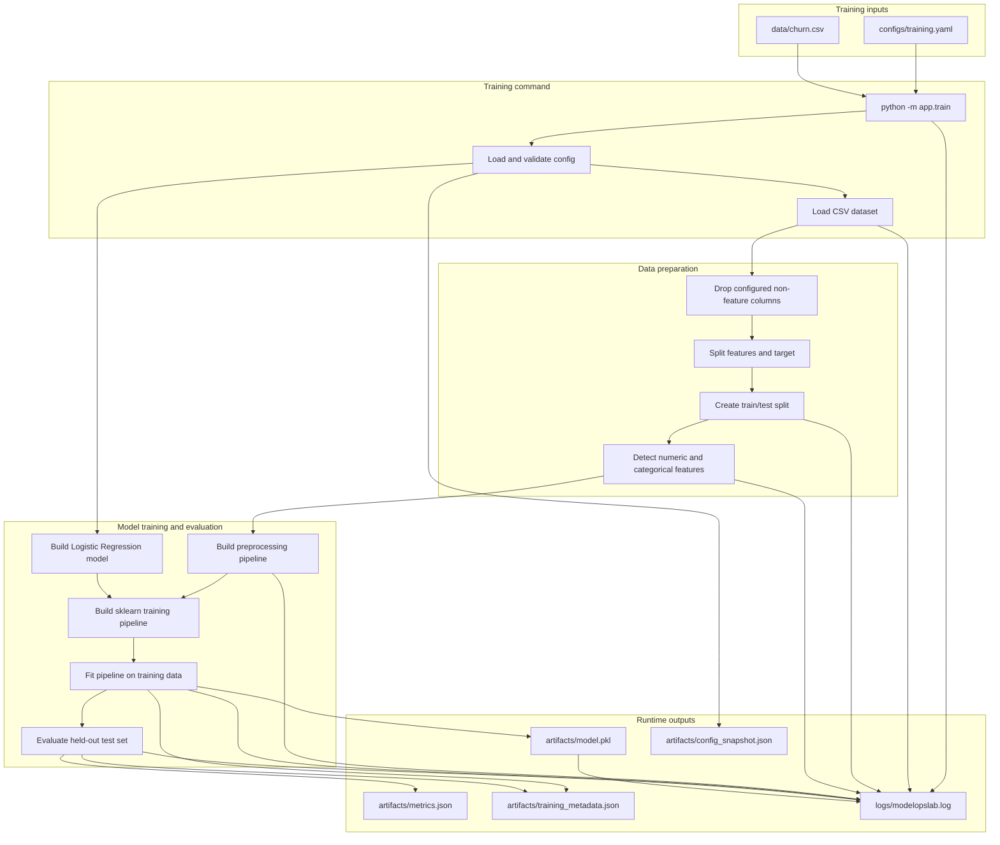

# V1 Pipeline Flow

This diagram shows the completed V1 baseline training workflow.

It is intentionally limited to V1 scope: config-driven training, baseline preprocessing/model flow, artifact persistence, and readable runtime logs.



## Runtime Outputs

```text
artifacts/model.pkl
artifacts/metrics.json
artifacts/config_snapshot.json
artifacts/training_metadata.json
logs/modelopslab.log
```

## Operational Meaning

V1 establishes the baseline training path.

The training command loads the configured dataset, prepares features, fits a Logistic Regression baseline, evaluates it on a held-out split, persists local runtime artifacts, and writes readable logs for inspection.
