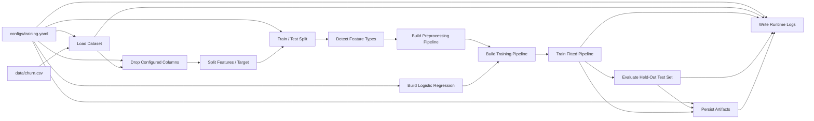

# V1 Pipeline Flow

This diagram shows the completed V1 baseline training workflow.



## Outputs

```text
artifacts/model.pkl
artifacts/metrics.json
artifacts/config_snapshot.json
artifacts/training_metadata.json
logs/modelopslab.log
```
