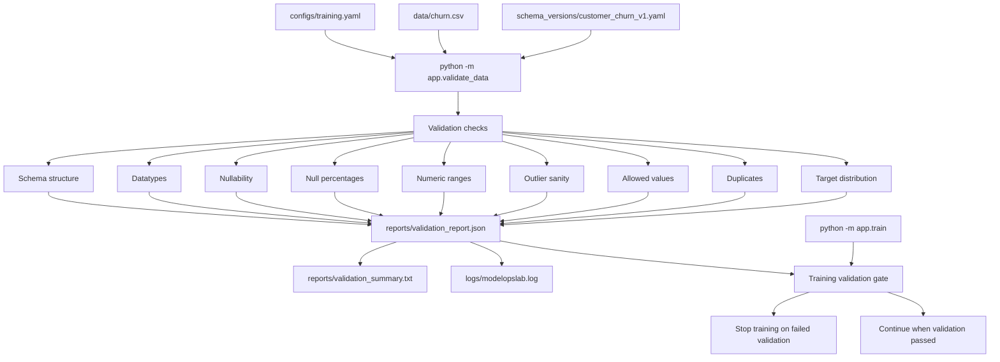

# V2 Validation Flow

This diagram shows the completed V2 data validation flow.

It is intentionally limited to V2 scope: schema checks, data quality checks, report persistence, readable logs, and the training validation gate.

## Operational Meaning

V2 makes data validation a first-class step before training.

The validation command loads the configured dataset and versioned schema, runs deterministic checks, persists machine-readable and human-readable reports, writes readable logs, and supplies the training gate with a pass/fail decision.
