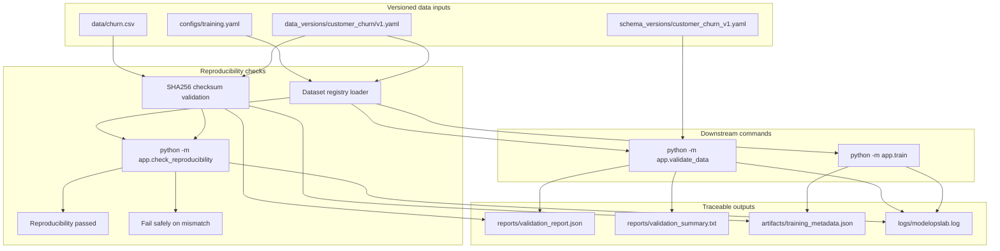

# V3 Reproducibility Flow

This diagram shows the completed V3 dataset versioning and reproducibility workflow.

It is intentionally limited to V3 scope: dataset registry metadata, checksum tracking, reproducibility checks, and dataset version traceability in validation and training outputs.

## Operational Meaning

V3 makes dataset identity explicit and verifiable.

The dataset registry records which dataset version is active and which checksum the physical dataset file must match. The reproducibility command verifies that local file content still matches the registered version, while validation reports and training metadata preserve the dataset version and checksum used by each run.
