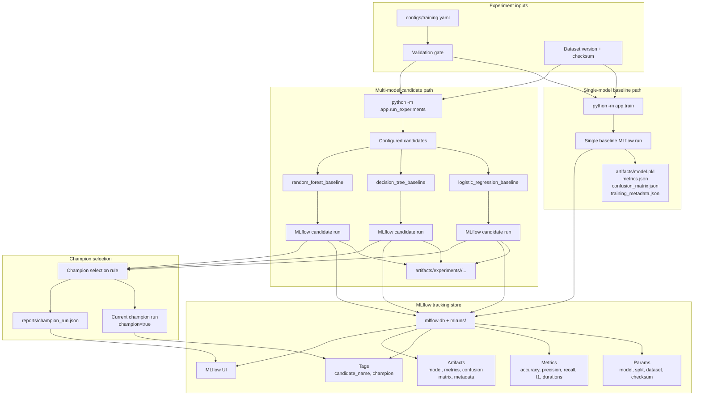

# V4 Experiment Tracking Flow

This diagram shows the completed V4 experiment tracking and champion selection workflow.

It is intentionally limited to V4 scope: MLflow run tracking, single-model training, multi-model candidate experiments, artifact logging, champion selection, and the champion report.

## Operational Meaning

V4 makes experiment tracking useful, not just present.

The single-model path keeps a stable baseline command. The multi-model path trains configured candidates as separate MLflow runs, logs their params, metrics, tags, and artifacts, applies the documented champion selection rule, clears stale champion tags, marks exactly one current champion, and writes `reports/champion_run.json` as the local decision record.
