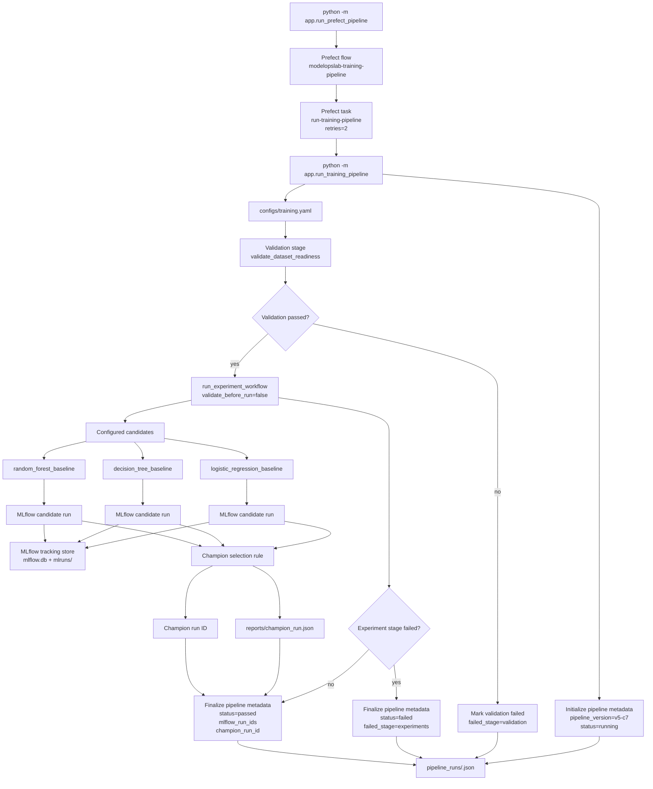

# V5 Training Pipeline Flow

This diagram shows the current V5 training pipeline.

It is intentionally limited to the implemented V5 behavior: local Prefect orchestration, pipeline metadata, single validation ownership, reusable experiment workflow, MLflow candidate runs, champion selection, and failure-stage recording.

## Operational Meaning

V5 introduces a pipeline-level view of training.

The Prefect command wraps the existing plain Python pipeline in a local Prefect flow and task. The pipeline command owns validation once, then calls the reusable experiment workflow with validation disabled for that inner workflow. Candidate models still create MLflow runs, the champion selection logic still writes `reports/champion_run.json`, and the pipeline writes a separate run record under `pipeline_runs/`.

Pipeline metadata is not model metadata and it is not MLflow metadata. It records workflow-level state: stage status, failed stage, dataset version, MLflow run IDs, and champion run ID.

## Current Boundary

Prefect is active as a local wrapper.

Scheduled Prefect deployments are not active yet.

The current V5 pipeline can still run without Prefect through `python -m app.run_training_pipeline`. The Prefect command adds local flow/task orchestration around that proven behavior.
