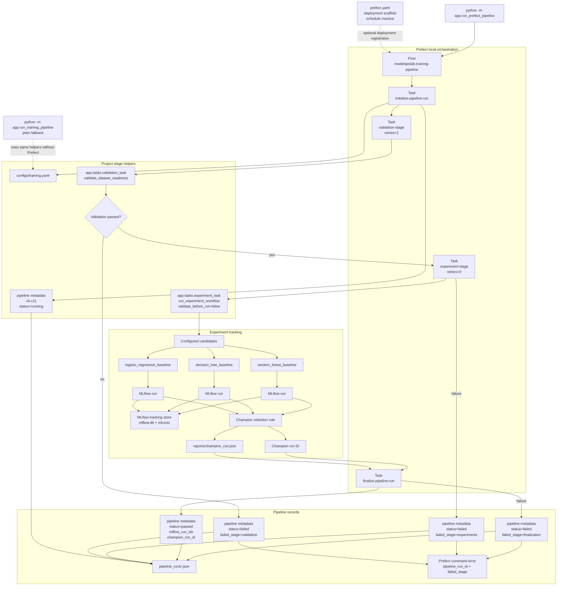

# V5 Training Pipeline Flow

This diagram shows the current V5 training pipeline.

It is intentionally limited to the implemented V5 behavior: local Prefect stage-level orchestration, optional inactive deployment scaffold, pipeline metadata, extracted stage helpers, single validation ownership, reusable experiment workflow, MLflow candidate runs, champion selection, and failure-stage recording.

## Operational Meaning

V5 introduces a pipeline-level view of training.

The Prefect command runs the training pipeline as local stage-level Prefect tasks. The plain Python pipeline command remains available as the fallback path, while the Prefect flow now exposes initialization, validation, experiment, and finalization as separate task states. Validation uses a small retry policy. The experiment task does not retry because retrying candidate runs can create duplicate MLflow runs. Candidate models still create MLflow runs, the champion selection logic still writes `reports/champion_run.json`, and the pipeline writes a separate run record under `pipeline_runs/`.

Pipeline metadata is not model metadata and it is not MLflow metadata. It records workflow-level state: stage status, failed stage, dataset version, MLflow run IDs, and champion run ID.

When the Prefect-wrapped pipeline fails, the command-level error preserves the failed `pipeline_run_id` and `failed_stage` from the pipeline metadata so the matching `pipeline_runs/<pipeline_run_id>.json` file can be inspected directly.

## Current Boundary

Prefect is active as a local wrapper.

The Prefect deployment scaffold exists, but its schedule is inactive by default.

The current V5 pipeline can still run without Prefect through `python -m app.run_training_pipeline`. The Prefect command adds local stage-level flow/task orchestration around the same validation and experiment helpers.
