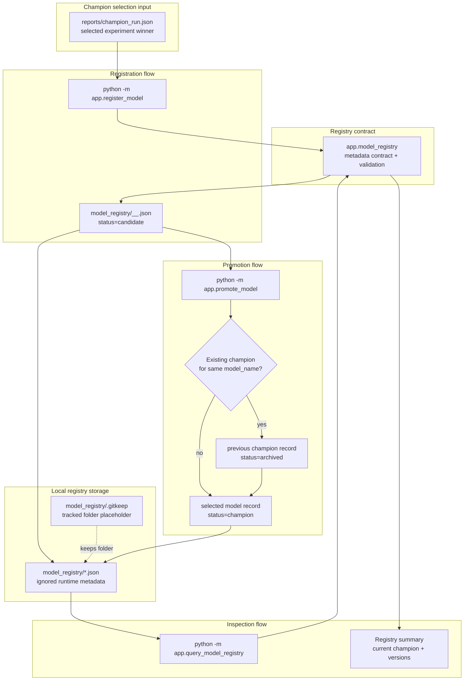

# V6 Model Registry Flow

This diagram shows the current V6 model registry lifecycle.

It is intentionally limited to implemented V6 behavior: local registry metadata, champion registration, candidate promotion, single champion enforcement, archive handling, and registry query inspection.

## Operational Meaning

V6 turns the V4 champion decision into a managed model lifecycle record.

The registration command reads the champion report and writes a candidate model version into the local registry. Promotion is a separate command. It only promotes candidate records, archives any previous champion for the same model name, and keeps unrelated model champions untouched. Querying the registry gives a command-level view of the current champion and registered versions without opening JSON files manually.

The local registry is project metadata, not MLflow tracking storage. MLflow still owns experiment runs, metrics, params, and run artifacts. The V6 registry owns model version lifecycle state.

## Current Boundary

The registry is local and file-based.

Generated registry JSON files are ignored by git. The repository tracks only the `model_registry/.gitkeep` placeholder and the code/docs that define the registry behavior.

Rollback behavior is not implemented yet.
