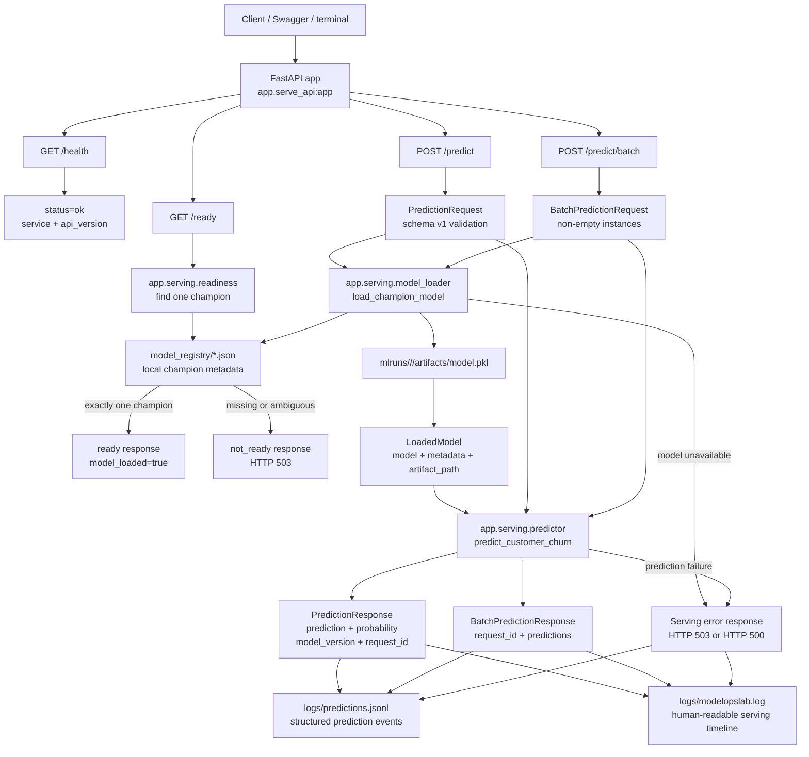

# V7 Serving Flow

This diagram shows the current V7 model serving flow.

It is intentionally limited to implemented V7 behavior: FastAPI health/readiness endpoints, single prediction, batch prediction, schema validation, local registry-based model loading, prediction service execution, prediction audit logging, and serving runtime logging.



## Operational Meaning

V7 turns the locally managed champion model into an HTTP-serving surface.

The API exposes health and readiness separately. Health only proves the FastAPI service is alive. Readiness checks local registry state and reports ready only when one champion model is available. Prediction requests are validated with Pydantic before model loading or prediction execution.

Single and batch prediction use the same model loading and prediction service foundations. The serving layer loads the champion model from local registry metadata, resolves the local MLflow artifact path, runs prediction, and returns model version plus request ID in the response.

Serving observability has two log outputs:

```text
logs/modelopslab.log
  human-readable runtime timeline

logs/predictions.jsonl
  structured prediction audit events
```

## Current Boundary

V7 serving is local FastAPI serving.

The API is started with:

```powershell
uvicorn app.serve_api:app --reload
```

Generated runtime files are ignored by git:

```text
logs/
mlruns/
model_registry/*.json
artifacts/
```
