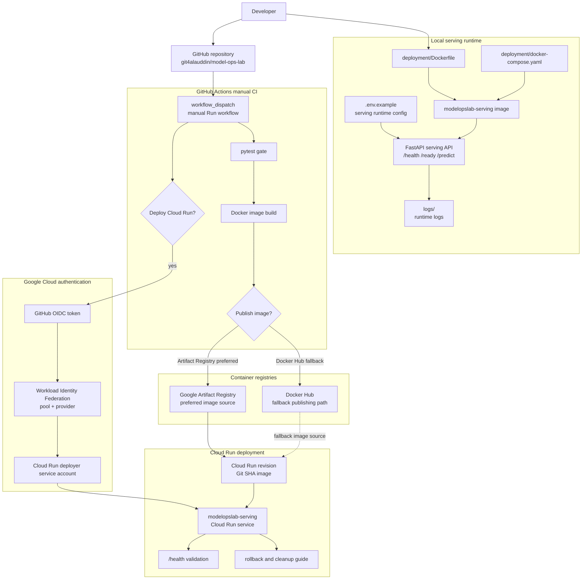

# V8 Deployment Flow

This diagram shows the final V8 Dockerization and deployment foundation.

It is intentionally limited to implemented V8 behavior: local Docker serving image, Docker Compose runtime, GitHub Actions manual CI, Docker image publishing, Artifact Registry, Cloud Run deployment, Workload Identity Federation, and rollback/cleanup documentation.



## Operational Meaning

V8 turns the local FastAPI serving API into a deployable containerized service.

The local path uses `deployment/Dockerfile` and `deployment/docker-compose.yaml` to prove the serving API can run inside Docker with explicit runtime configuration. The CI path uses GitHub Actions with a manual trigger, so deployment remains intentional while the project is still learning production infrastructure.

The preferred final deployment path is:

```text
GitHub Actions manual trigger
-> pytest
-> Docker image build
-> Artifact Registry push
-> Cloud Run deploy from Artifact Registry
-> /health check
```

Workload Identity Federation is the authentication bridge between GitHub Actions and Google Cloud. It avoids long-lived service account keys by allowing GitHub Actions to impersonate the Cloud Run deployer service account through short-lived credentials.

## Current Boundary

V8 is closed as the deployment foundation.

It validates Cloud Run `/health`, but it intentionally stops before production serving hardening:

```text
no automatic deploy on push
no private Cloud Run auth path
no live /ready validation with external model artifacts
no live /predict validation on Cloud Run
no monitoring or alerting
no Terraform/IaC
```

Those concerns move to later versions.
