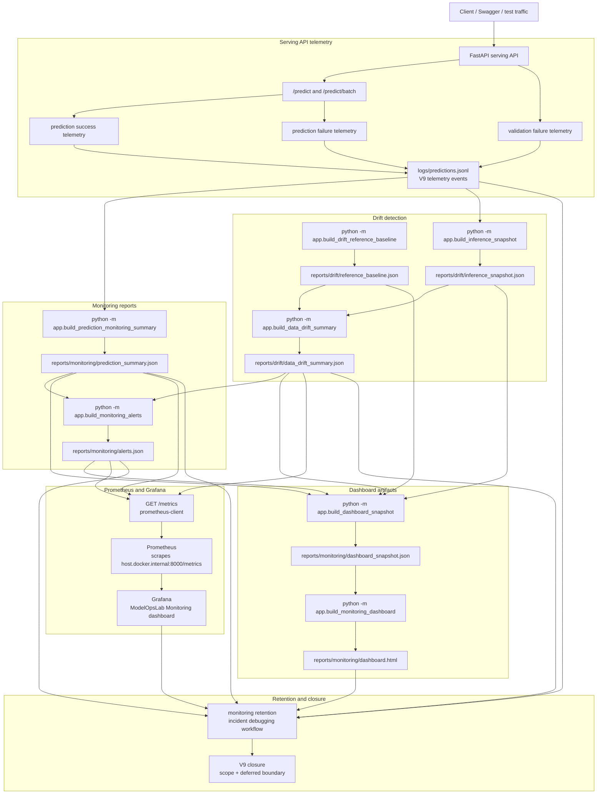

# V9 Observability Flow

This diagram shows the final V9 monitoring, drift detection, and production observability foundation.

It is intentionally limited to implemented V9 behavior: prediction telemetry, local monitoring reports, alert rules, drift comparison, dashboard snapshot, static dashboard, Prometheus `/metrics`, Prometheus scraping, Grafana dashboarding, retention guidance, and incident debugging workflow.



## Operational Meaning

V9 turns the serving system into an observable ML service.

Prediction requests produce structured telemetry events. Local commands convert those events into monitoring summaries, alert reports, drift baselines, inference snapshots, and data drift summaries. The dashboard snapshot combines those report outputs into one dashboard-ready contract, then the local HTML dashboard renders a no-service visual view.

The Prometheus path exposes the same local monitoring signals through:

```text
GET /metrics
```

Prometheus scrapes the endpoint and Grafana visualizes the time-series metrics through the provisioned `ModelOpsLab Monitoring` dashboard.

The incident debugging workflow ties the visual layer back to the source evidence:

```text
Grafana symptom
-> Prometheus metric
-> local monitoring report
-> raw prediction telemetry
```

## Current Boundary

V9 is closed as the local-first observability foundation.

It includes:

```text
prediction telemetry
local monitoring reports
alert-ready metrics
data drift comparison
dashboard artifacts
Prometheus metrics endpoint
Grafana local stack
retention and incident workflow
```

It intentionally defers:

```text
real concept drift automation
alert notification channels
long-term Prometheus storage
managed cloud monitoring
production retention backend
automatic remediation
```
